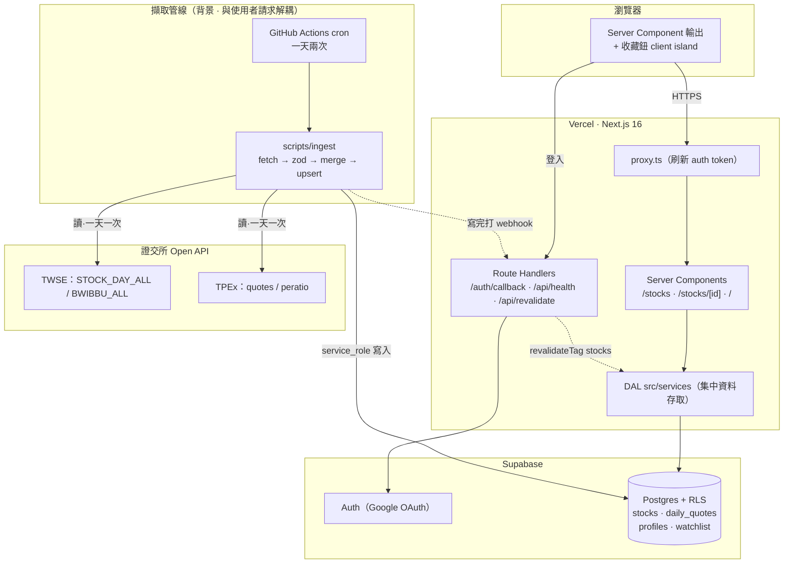

# 股市資訊站 · Taiwan Stock Info

台股（上市 + 上櫃）股價與本益比資訊網站。每個交易日自動從**證交所 / 櫃買中心 Open API** 擷取收盤資料，經驗證、合併後寫入 Supabase，前端以 Next.js 16 呈現個股行情、近期走勢與個人收藏清單。

> 這是一份**求職作品集**專案，重點不只在「做出功能」，而在展現一套可維護、可擴充、對安全與效能有意識的**全端工程實作**。所有關鍵決策都有對應的教學文件與架構決策紀錄（ADR）在 [`docs/`](docs/)。


---

## 目錄

- [線上 Demo](#線上-demo)
- [核心亮點](#核心亮點)
- [技術棧](#技術棧)
- [功能](#功能)
- [系統架構](#系統架構)
- [資料模型](#資料模型)
- [專案結構](#專案結構)
- [本機開發](#本機開發)
- [環境變數](#環境變數)
- [資料擷取管線](#資料擷取管線)
- [測試](#測試)
- [部署](#部署)
- [設計決策與延伸文件](#設計決策與延伸文件)
- [Roadmap 與已知限制](#roadmap-與已知限制)

---

## 線上 Demo

- **網站**：`https://<your-app>.vercel.app` &nbsp;_(部署後填入)_
- 可直接瀏覽的公開頁：`/stocks`（股票列表）、`/stocks/2330`（個股頁，以台積電為例）
- 收藏功能需以 Google 登入。

---

## 核心亮點

這個專案刻意用「一個資訊網站」的外表，去實作幾個**正式系統才會遇到**的工程主題：

| 主題 | 具體做法 |
|---|---|
| **擷取 / 讀取分離** | 抓資料是背景排程慢慢做，使用者只讀「已算好」的資料 → 避開 Serverless 執行時間限制、外部 API 延遲對使用者無感 |
| **資料正確性** | zod 驗證外部 API 形狀、民國年轉換、**兩支 API 日期一致性把關**（本益比與報價日期不同步時寧可留白也不張冠李戴）、複合主鍵 + 冪等 upsert |
| **縱深防禦安全** | `getUser()` 而非 `getSession()`、RLS 為最後防線、Server Action 視同公開端點在 DAL 內重驗、webhook 用常數時間密鑰比對防 timing attack |
| **效能** | 公開讀取以 `unstable_cache` + tag 快取，擷取寫完打 webhook 做 **on-demand 精準失效**（當天更新，不必等 TTL）；個股頁因含個人收藏而刻意保持動態 |
| **可測試性** | 商業邏輯抽成**純函式**（民國年、數值解析、合併、漲跌、錯誤映射、密鑰比對），以 Vitest 覆蓋；DAL 只做 I/O |
| **工程紀律** | Database-as-Code（Supabase CLI migrations）、CI（push 觸發 lint + typecheck + test）、ADR 記錄架構決策與重啟條件 |

---

## 技術棧

| 層 | 選用 |
|---|---|
| 前端 / 框架 | **Next.js 16**（App Router、React Compiler）、**React 19**、TypeScript 5 |
| 樣式 | Tailwind CSS v4、lucide-react |
| 後端 / 資料 | **Supabase**（PostgreSQL + Auth + 自動 PostgREST）、`@supabase/ssr` |
| 驗證 | Zod 4 |
| 測試 | Vitest 4 |
| 擷取腳本 | Node（`--import tsx` 直跑 TS）、原生 `fetch` |
| 部署 / 自動化 | Vercel、GitHub Actions（排程擷取 + CI） |

---

## 功能

- **Google 登入**（Supabase Auth OAuth）：Server Action 發起 → `/auth/callback` 以 code 換 session；`proxy.ts` 每個請求刷新 token。
- **股票列表** `/stocks`：公開頁，任何人可瀏覽（RLS 允許公開讀）。
- **個股頁** `/stocks/[id]`：最新收盤、漲跌與漲跌幅（台股紅漲綠跌）、本益比、成交量，以及近期報價表；查無此股回 404。
- **收藏 ★**：登入後可收藏個股，採 **樂觀更新**（`useOptimistic`），失敗自動回退；資料以 RLS 嚴格隔離（使用者只能存取自己的收藏）。
- **健康檢查** `/api/health`：零依賴 liveness 探針，兼作部署煙霧測試。

---

## 系統架構

**一句話**：背景排程把證交所資料寫進 Supabase；使用者端只讀資料庫。兩條流完全解耦。



- **讀取端**：`/stocks`、`/stocks/[id]` 的公開資料經 `unstable_cache`（tag = `stocks`）快取；頁面設保底 ISR TTL。
- **失效機制**：擷取寫入成功後，`scripts/ingest/revalidate.ts` 以密鑰呼叫 `POST /api/revalidate` → `revalidateTag('stocks')` 立即失效 → 使用者當天看到新資料。
- **個股頁**含「每人不同」的收藏狀態，因此**刻意不整頁 ISR**（避免把 A 的收藏狀態送給 B）；昂貴的股價查詢仍走快取，只有收藏是動態的 client island。詳見 [快取與 on-demand revalidation 教學](docs/快取與on-demand-revalidation教學.md) 與 [架構總覽](docs/架構總覽-瓶頸與擴展.md)。

---

## 資料模型

以 Supabase migration 定義（[`supabase/migrations/`](supabase/migrations/)），全部啟用 RLS：

| 資料表 | 主鍵 | 用途 | RLS 政策 |
|---|---|---|---|
| `profiles` | `id` → `auth.users` | 使用者基本資料，註冊時由 trigger 自動建立 | 公開讀、僅本人可改 |
| `stocks` | `id`（股票代號） | 股票主檔（名稱、市場別 TWSE/TPEX） | **公開讀、禁止前端寫**（僅 service_role 寫入） |
| `daily_quotes` | `(stock_id, trade_date)` | 每日報價時間序列（收盤、本益比、成交量） | **公開讀、禁止前端寫** |
| `watchlist` | `(user_id, stock_id)` | 使用者收藏 | **僅本人可讀 / 增 / 刪**（`auth.uid() = user_id`） |

> `stocks` / `daily_quotes` 只給 `select` 政策、不給寫入政策 → 前端（anon / authenticated 角色）一律無法寫，只有擷取程式用的 `service_role` 金鑰（繞過 RLS）能寫。這是「公開唯讀資料」的標準隔離做法。

---

## 專案結構

```
src/
├── app/
│   ├── page.tsx                    首頁 / dashboard（需登入）
│   ├── login/page.tsx              Google 登入頁（Server Action 觸發 OAuth）
│   ├── auth/
│   │   ├── actions.ts              signInWithGoogle / signOut
│   │   └── callback/route.ts       OAuth 回呼：code → session
│   ├── stocks/
│   │   ├── page.tsx                股票列表（公開，ISR）
│   │   ├── [id]/page.tsx           個股頁（公開資料 + 個人收藏鈕）
│   │   └── actions.ts              toggleWatchlistAction（Server Action）
│   └── api/
│       ├── health/route.ts         liveness 探針 / 部署煙霧測試
│       └── revalidate/route.ts     快取失效 webhook（密鑰保護，僅 POST）
├── components/
│   └── watchlist-button.tsx        唯一的 client island（★ 樂觀更新）
├── services/                       DAL：所有 DB 存取集中於此
│   ├── profile.ts
│   ├── stocks.ts                   公開讀取 + unstable_cache + tag
│   └── watchlist.ts                私人資料：cookie client + getUser + RLS
├── lib/                            純函式 + 型別（可單元測試）
│   ├── quote.ts (.test)            漲跌計算、數值格式化
│   ├── watchlist.ts (.test)        輸入驗證、DB 錯誤 → 對外代碼、文案
│   └── revalidate-auth.ts (.test)  常數時間密鑰比對
├── utils/supabase/
│   ├── server.ts                   cookie-based client（會員路徑）
│   ├── client.ts                   browser client
│   └── public.ts                   cookieless 公開 client（可被快取）
└── proxy.ts                        Next 16 proxy（原 middleware）：刷新 auth token

scripts/ingest/                     擷取管線（背景，與 app 解耦）
├── run.ts                          進入點
├── fetch-twse.ts / fetch-tpex.ts   兩市場各兩支 API
├── merge.ts (.test)                報價 × 本益比合併（日期一致性把關）
├── roc-date.ts (.test)             民國年 → 西元
├── types.ts (.test)                zod schema + numOrNull 數值解析
├── http.ts                         重試（指數退避）+ User-Agent
├── upsert.ts                       冪等 upsert
├── revalidate.ts                   寫完打 webhook（best-effort）
└── supabase-admin.ts               service_role client（隔離於 app 之外）

supabase/migrations/                Database-as-Code
.github/workflows/
├── ci.yml                          push → lint + tsc + test
└── ingest.yml                      cron 一天兩次 → 擷取
docs/                               教學與架構決策文件（見下）
```

---

## 本機開發

### 先決條件

- **Node.js 20.6+**（擷取腳本用到內建 `--env-file` 與 `--import`；開發使用 22 LTS）
- 一個 **Supabase 專案**（雲端或本機 CLI），並在 Supabase Dashboard 設定 **Google OAuth provider**
- （選用）Supabase CLI，用來套用 migration

### 步驟

```bash
# 1. 安裝相依套件
npm install

# 2. 設定環境變數（見下一節），建立 .env.local

# 3. 套用資料庫 migration 到你的 Supabase 專案
npx supabase db push

# 4. 啟動開發伺服器
npm run dev            # http://localhost:3000

# 5.（選用）手動跑一次擷取，把當日股價寫進 DB
npm run ingest
```

Google 登入要能運作，需在 Supabase Dashboard → Authentication → URL Configuration 把 `http://localhost:3000/**` 加入 Redirect URLs。

---

## 環境變數

於 `.env.local`（已被 `.gitignore` 排除，切勿提交）：

| 變數 | 用途 | 誰需要 |
|---|---|---|
| `NEXT_PUBLIC_SUPABASE_URL` | Supabase 專案 URL | 前端 + 擷取 |
| `NEXT_PUBLIC_SUPABASE_ANON_KEY` | anon 公鑰（受 RLS 保護） | 前端 |
| `SUPABASE_SERVICE_ROLE_KEY` | **繞過 RLS 的最高權限金鑰**，僅供擷取寫入 | 擷取（本機 / GitHub Actions） |
| `REVALIDATE_URL` | 線上 `/api/revalidate` 端點 | 擷取（選用，做 on-demand 失效才需要） |
| `REVALIDATE_SECRET` | webhook 密鑰，兩端需一致 | 擷取 + 網站 |

> ⚠️ `SUPABASE_SERVICE_ROLE_KEY` 外洩等於資料庫門戶大開：**絕不可**加 `NEXT_PUBLIC_` 前綴（會被打包進瀏覽器）、不可提交進 git。它只存在於 `.env.local` 與 GitHub Actions / Vercel 的 Secrets。

---

## 資料擷取管線

`scripts/ingest/` 是與 Next.js app 完全獨立的一支 Node 程式，流程為 **抓取 → 驗證 → 合併 → 冪等寫入 → 觸發快取失效**：

1. **抓取**：並行打 TWSE（上市）與 TPEx（上櫃）各兩支 Open API（收盤 / 本益比）；`http.ts` 帶重試與 `User-Agent`（TPEx 會擋無瀏覽器特徵的請求）。
2. **驗證**：zod 驗證每支 API 的欄位形狀，格式一變就大聲失敗，而非默默寫錯。
3. **合併**：以股票代號合併報價與本益比，並**要求兩支 API 的日期一致**才採用該本益比，否則留 `null`（避免把前一日 PE 接到當日報價）。民國年（如 `1150701`）轉西元。
4. **寫入**：以複合主鍵 `(stock_id, trade_date)` 做 `upsert` → **冪等**，同一天重跑不會重複。
5. **失效**：寫入成功後 best-effort 呼叫 `/api/revalidate` 清除線上 `stocks` 快取。

兩市場以 `Promise.allSettled` 獨立處理：一邊失敗，另一邊照常寫入，但整體以非零結束碼結束，讓 GitHub Actions 標記失敗以利發現。

**排程**（[`.github/workflows/ingest.yml`](.github/workflows/ingest.yml)）：`cron` 每個交易日跑兩次（隔天早上與當日晚上，UTC）。之所以不在收盤當天傍晚跑，是因為實測 TWSE 的 `STOCK_DAY_ALL` 公布很晚——這個踩雷與修正記錄在 [排程自動化教學](docs/排程自動化教學.md)。

手動執行：`npm run ingest`（本機，讀 `.env.local`）／`npm run ingest:ci`（CI，讀環境變數）。

---

## 測試

商業邏輯抽成純函式後以 **Vitest** 覆蓋（民國年轉換、數值解析、報價合併與日期一致性、漲跌計算、watchlist 錯誤映射、webhook 密鑰比對）。DAL 只做 I/O，不在單元測試範圍。

```bash
npm test           # 跑一次
npm run test:watch # 監看模式（TDD）
```

CI（[`.github/workflows/ci.yml`](.github/workflows/ci.yml)）在每次 push 到 `main` 時執行 **lint + `tsc --noEmit` + 測試**，任一失敗即擋下。

測試哲學與如何擴充見 [測試教學-vitest](docs/測試教學-vitest.md)。

---

## 部署

- **網站**：部署於 **Vercel**（import GitHub repo 即自動偵測 Next.js）。需在 Vercel 專案設定 `NEXT_PUBLIC_SUPABASE_URL`、`NEXT_PUBLIC_SUPABASE_ANON_KEY`（以及做 on-demand 失效所需的 `REVALIDATE_SECRET`）。部署後將 Vercel 網址加入 Supabase 的 Redirect URLs，Google 登入才能運作。
- **擷取排程**：由 GitHub Actions 執行，金鑰存於 repo 的 Actions Secrets，與網站部署互相獨立。

---

## 設計決策與延伸文件

`docs/` 收錄了本專案的教學與**架構決策紀錄（ADR）**——記錄「為什麼這樣做、當時的權衡、何時該重新考慮」：

| 文件 | 內容 |
|---|---|
| [開發核心觀念教學](docs/開發核心觀念教學.md) | Server/Client 拆分、getUser vs getSession、RLS、DAL、連線池、快取等全端觀念（從零到深） |
| [從零手刻-建置順序與元件拆解](docs/從零手刻-建置順序與元件拆解.md) | 專案是怎麼一步步長出來的 |
| [資料擷取管線教學](docs/資料擷取管線教學.md) | 擷取管線逐檔說明、API 細節、如何加欄位 / 加資料源 |
| [排程自動化教學](docs/排程自動化教學.md) | GitHub Actions 排程、cron、TWSE 公布延遲踩雷 |
| [測試教學-vitest](docs/測試教學-vitest.md) | 測試設定、心法、如何擴充 |
| [快取與 on-demand-revalidation 教學](docs/快取與on-demand-revalidation教學.md) | `unstable_cache` + tag + webhook 的實作 |
| [架構總覽-瓶頸與擴展](docs/架構總覽-瓶頸與擴展.md) | 完整架構圖、快取點盤點、瓶頸分析與擴展順序 |
| [ADR-0001-快取策略與 revalidate-webhook](docs/ADR-0001-快取策略與revalidate-webhook.md) | 快取層的決策紀錄與重啟條件 |

---

## Roadmap 與已知限制

- [ ] **本益比排行榜**：需先為 `stocks` 補「產業別 / 市場別」欄位並多擷取對應 API，再依使用者選擇篩選（保留可擴充性）。
- [ ] **`/watchlist` 收藏列表頁**：目前收藏僅在個股頁操作，尚無彙整頁。
- [ ] **ETF 過濾**：`STOCK_DAY_ALL` 含 ETF（本益比為 `null`），列表尚未區分。
- [ ] **歷史資料回補**：目前每次只抓最新交易日，尚無回補區間歷史的腳本。
- [ ] **Observability**：擷取失敗目前僅靠 GitHub Actions 的紅燈與 email，未接 Sentry 主動告警。
- [ ] **E2E 測試**：尚未加入 Playwright 覆蓋登入與關鍵頁流程。

---

_本專案為個人求職作品集，程式碼與文件皆以中文註解，著重展示工程判斷與可維護性。_
