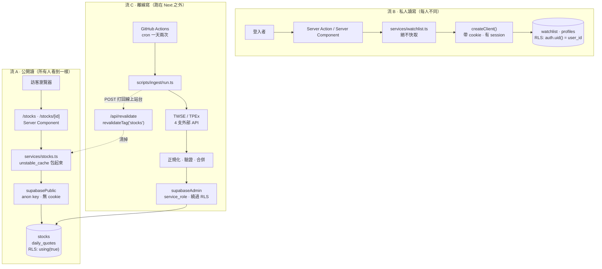

# 從零手刻：股市資訊站 · 建置順序與元件拆解

> 這份文件回答的不是「這個專案有什麼」，而是：
> **如果今天從一個空資料夾開始，該用什麼順序、什麼思維、一次只加哪一個元件，才能把它刻出來並且看懂每一行。**
>
> 讀法：Part 1–2 是心法（15 分鐘，決定你之後每個檔案放哪），Part 3 是照著做的 11 個里程碑，Part 4 是語法索引，Part 5 是你目前專案的真實缺口。

---

## 目錄

- [Part 1 · 這個系統只有三條資料流](#part-1--這個系統只有三條資料流)
- [Part 2 · 分層與依賴方向](#part-2--分層與依賴方向)
- [Part 3 · 建置順序：11 個里程碑](#part-3--建置順序11-個里程碑)
- [Part 4 · 語法索引](#part-4--語法索引)
- [Part 5 · 你現在的專案缺什麼](#part-5--你現在的專案缺什麼)
- [Part 6 · 陷阱清單](#part-6--陷阱清單)

---

## Part 1 · 這個系統只有三條資料流

先不要想檔案。先問：**這個系統裡有幾種「東西在動」？**

答案是三種。整個架構裡幾乎每一個看起來很怪的決定，都是在回答「這段程式屬於哪一條流」。



### 三條流的性質對照

| | 流 A 公開讀 | 流 B 私人讀寫 | 流 C 離線寫 |
|---|---|---|---|
| **誰在用** | 任何訪客（不用登入） | 已登入使用者 | 排程機器人 |
| **資料變動頻率** | 一天 1–2 次 | 隨時 | — |
| **每人看到的內容** | 完全相同 | 每人不同 | — |
| **能不能快取** | ✅ 應該重度快取 | ❌ 絕對不行 | — |
| **用哪個 client** | `supabasePublic`（無 cookie） | `createClient()`（讀 cookie） | `supabaseAdmin`（service_role） |
| **安全靠什麼** | RLS `using (true)` 公開讀 | RLS `auth.uid() = user_id` + DAL 先 `getUser()` | 金鑰保密（繞過 RLS） |
| **對應檔案** | `services/stocks.ts` | `services/watchlist.ts`、`services/profile.ts` | `scripts/ingest/*` |

### 從三條流推導出的第一個關鍵結論

**「有沒有讀 cookie」和「能不能被快取」是同一件事的兩面。**

cookie 是 *每個請求都不同* 的資料。Next 的快取（`unstable_cache`）是 *跨請求共用* 的。
把「每請求不同」的東西放進「跨請求共用」的盒子裡，語意本身就矛盾 —— 所以 Next 直接禁止你在 `unstable_cache` 裡讀 cookie。

這一條就推導出：**你必須有第三個 Supabase client**。

```
server.ts  → createServerClient + cookies()  → 有 session，不可快取
public.ts  → createClient + anon key，無 cookie → 無 session，可以快取  ← 為了流 A 存在
client.ts  → createBrowserClient            → 跑在瀏覽器裡的 Client Component 用
```

> 很多人第一次寫 Supabase + Next 卡在這裡：把 `server.ts` 的 client 塞進 `unstable_cache`，然後在 runtime 炸掉。原因不是 bug，是**你把流 B 的工具拿去做流 A 的事**。

---

## Part 2 · 分層與依賴方向

### 四層 + 一個離線區

```
src/app/          呈現層     頁面(page.tsx)、端點(route.ts)、動作(actions.ts)
      ↓
src/services/     DAL       唯一允許呼叫 supabase 查詢的地方；安全檢查在這裡
      ↓
src/utils/supabase/  連線層  三種身分的 client 工廠
src/lib/          純函式層   零 IO：計算、格式化、映射、驗證

scripts/ingest/   離線管線   完全不 import src/ 的東西，可以單獨用 node 跑
```

**鐵則：箭頭只能往下。** `lib/` 不准 import `services/`；`services/` 不准 import `app/`。

為什麼要堅持這件事？三個具體好處：

1. **可測性**：`lib/` 沒有 IO，Vitest 直接載入就能測，不用起資料庫、不用 mock。
   （反例就在你專案裡：`src/lib/watchlist.ts` 的註解明講「刻意不 import 任何 Next / Supabase server 的東西，才能被 Vitest 直接載入」——因為 server client 相依 `next/headers`，測試環境載不動。）
2. **安全可審**：所有 DB 存取集中在 `services/`，要檢查「有沒有哪裡忘了驗身分」，只要看一個資料夾。
3. **可替換**：哪天不用 Supabase 了，改的是 `utils/` + `services/`，頁面一行不用動。

### 判斷樹：這段程式碼該放哪？

寫每一個新函式之前，跑一次這棵樹：

```
① 它會碰 IO 嗎（資料庫、網路、檔案、時間、亂數）？
   ├─ 不會 →  src/lib/xxx.ts        ← 而且「一定」要順手寫測試
   └─ 會   →  往 ②

② 它碰的是「我自己的資料庫」嗎？
   ├─ 是   →  src/services/xxx.ts   ← DAL，第一行先做身分檢查（若是私人資料）
   └─ 否（外部 API）→ scripts/ingest/xxx.ts

③ 它是「使用者按下去會發生事情」嗎？
   └─ 是   →  Server Action：src/app/**/actions.ts，檔案頂端 'use server'

④ 它是「機器來打的端點」嗎（webhook、健康檢查、OAuth 回呼）？
   └─ 是   →  Route Handler：src/app/**/route.ts，export GET/POST

⑤ 它是「畫面」嗎？
   └─ 是   →  page.tsx / layout.tsx / 元件
```

這棵樹能解釋你專案裡每一個檔案為什麼在那個位置。例如：

- `computeChange()` 是純計算 → `lib/quote.ts` ✅
- `isRevalidateAuthorized()` 是純比對 → `lib/revalidate-auth.ts` ✅（把「密鑰對不對」從「清快取」裡拆出來，才測得動）
- `mapWatchlistRows()` 是純轉換 → `lib/watchlist.ts` ✅
- `rocDateToIso()` 是純轉換，但只有管線用 → `scripts/ingest/roc-date.ts` ✅

---

## Part 3 · 建置順序：11 個里程碑

### 為什麼是這個順序（跟 git log 不一樣）

你專案的 commit 順序是：**認證 → 股票表 → 管線 → 快取 → watchlist**。

但如果重來一次，我會建議這個順序，理由是兩條原則：

1. **垂直切片**：每個里程碑結束時，都要有「能打開瀏覽器看到 / 能在終端跑起來」的東西。不要花三天做完全看不到成果的基礎建設。
2. **先正確，再快，再方便**：功能對了才談快取（M7 放在很後面不是偶然），資料對了才談登入。

> 認證放到 M8 的理由：認證是這個專案裡**最容易卡住、最沒有畫面回饋**的一塊（OAuth 設定、redirect URL、cookie 刷新）。先把它擺在前面，你會花一整個上午在 Google Cloud Console 跟 Supabase 後台之間切換，一行商業邏輯都沒寫。先做公開頁，你 90 分鐘就會看到第一個列表。

### 里程碑總覽

| # | 里程碑 | 產出 | 大概時間 |
|---|---|---|---|
| M0 | 專案骨架 | 跑得起來的空殼 | 20 分 |
| M1 | 資料模型 | 兩張表 + RLS + 手動假資料 | 40 分 |
| M2 | 第一條讀取路徑 | `/stocks` 列表頁 | 60 分 |
| M3 | 詳情頁 + 純函式 | `/stocks/[id]` | 60 分 |
| M4 | 測試骨架 | `npm test` 綠燈 | 30 分 |
| M5 | 資料擷取管線 | 真實台股資料進 DB | 3–4 小時 |
| M6 | 排程自動化 | GitHub Actions 每天跑 | 40 分 |
| M7 | 快取層 | 三層快取 + webhook 失效 | 90 分 |
| M8 | 認證 | Google 登入 | 2–3 小時 |
| M9 | 私人資料 watchlist | 收藏功能（含 UI） | 2 小時 |
| M10 | CI / 探針 / 文件 | 綠色 badge + ADR | 60 分 |

---

### M0 · 專案骨架

**🎯 要解決的問題**：有一個跑得起來、路徑別名設好、樣式能用的空殼。

**📦 元件**

| 檔案 | 職責 |
|---|---|
| `package.json` | 相依與腳本 |
| `tsconfig.json` | 其中 `paths: { "@/*": ["./src/*"] }` 是全專案 import 的基礎 |
| `next.config.ts` | `reactCompiler: true` |
| `src/app/layout.tsx` | 全站外框：`<html>`、字型變數、共用導覽列 |
| `src/app/globals.css` | Tailwind v4 進入點 |

**🔑 語法重點**

- `create-next-app` 選項：App Router ✅、TypeScript ✅、Tailwind ✅、src 目錄 ✅
- **路徑別名**：`@/services/stocks` ← 這個 `@` 是 `tsconfig.json` 的 `paths` 定義的，不是 npm 套件。
- **`RootLayout` 的型別**：`Readonly<{ children: React.ReactNode }>` — `children` 是 React 的特殊 prop，`ReactNode` 涵蓋字串/JSX/陣列/null。
- **字型變數**：`Geist({ variable: "--font-geist-sans" })` 產生一個 CSS 變數，掛在 `<html className={geistSans.variable}>`，Tailwind 再去引用它。
- **`export const metadata: Metadata`** — Next 讀這個物件去產生 `<title>` / `<meta>`，你不用自己寫 `<head>`。

**✅ 驗收**：`npm run dev` → `localhost:3000` 有畫面，導覽列在。

---

### M1 · 資料模型（先寫 SQL，一行 TypeScript 都不寫）

**🎯 要解決的問題**：確定「資料長什麼樣」。這是整個系統最難改的一層 —— 表結構定錯，上面所有程式都要重寫。

**📦 元件**：`supabase/migrations/xxxx_add_stocks_and_daily_quotes.sql`

```sql
create table public.stocks (
  id text primary key,       -- 用證交所代號當主鍵，不用流水號 uuid
  name text not null,
  market text,               -- 'TWSE' | 'TPEX'
  created_at timestamptz not null default now()
);

create table public.daily_quotes (
  stock_id text not null references public.stocks(id) on delete cascade,
  trade_date date not null,
  close_price numeric(10,2),
  pe_ratio numeric(10,2),
  volume bigint,
  created_at timestamptz not null default now(),
  primary key (stock_id, trade_date)   -- ← 這行是整個管線的關鍵
);
```

**🔑 這裡有四個真正的設計決策，每一個都要說得出理由**

1. **為什麼 `stocks.id` 用 `text` 當主鍵，而不是 uuid 流水號？**
   因為股票代號 `2330` 本身就是**天然主鍵**：全世界唯一、不會變、外部 API 也用它。多一層流水號只會逼你每次寫入前先查一次對照表。

2. **為什麼 `daily_quotes` 用複合主鍵 `(stock_id, trade_date)`？**
   這讓「同一檔股票同一天只能有一筆」變成**資料庫層級的保證**，而不是靠程式小心。直接的好處：擷取程式可以放心 `upsert`，同一天重跑十次結果都一樣（**冪等**）。這是 M5 能安心重跑的基礎。

3. **為什麼價格用 `numeric(10,2)` 不用 `float`？**
   浮點數會有 `0.1 + 0.2 = 0.30000000000000004` 的問題。金額一律用定點數。

4. **為什麼開了 RLS 卻只寫 select policy？**
   ```sql
   alter table public.stocks enable row level security;
   create policy "..." on public.stocks for select using (true);
   -- 刻意不建立 insert/update/delete policy
   ```
   RLS 是「預設拒絕」：**沒有 policy = 不准做**。所以只給 select 等於「前端（anon / authenticated 角色）永遠寫不進去」，只有拿 `service_role` 金鑰的擷取程式（繞過 RLS）能寫。
   👉 這是「用資料庫設定取代程式檢查」的典型 —— 就算你的 API 寫錯了，資料還是進不去。

**還有一個索引**：

```sql
create index idx_daily_quotes_stock_date on public.daily_quotes (stock_id, trade_date desc);
```
對應的查詢是 `.eq('stock_id', id).order('trade_date', desc).limit(30)`。索引欄位順序要跟查詢的「先篩選、後排序」順序一致。

**✅ 驗收**：`supabase db push` 後，在 Supabase Table Editor 手動塞 3 檔股票、每檔 3 天報價。**這批假資料就是 M2、M3 的燃料** —— 你不需要等管線寫完才有畫面。

---

### M2 · 第一條讀取路徑：把 DB 接到畫面

**🎯 要解決的問題**：打通流 A 的最短路徑。這一步做完，你就真正理解 Server Component 了。

**📦 元件（依建立順序）**

| 順序 | 檔案 | 職責 |
|---|---|---|
| 1 | `src/utils/supabase/public.ts` | 無 cookie 的 anon client（單例） |
| 2 | `src/services/stocks.ts` | `listStocks()` + `Stock` 型別 |
| 3 | `src/app/stocks/page.tsx` | 列表頁 |

**🔑 語法重點**

**(1) 為什麼 `public.ts` 是 module 層單例？**
```ts
export const supabasePublic = createClient(url, anonKey, {
  auth: { persistSession: false, autoRefreshToken: false },
})
```
它**無狀態**（不綁任何使用者），所以可以跨請求共用一個實例。對比 `server.ts` 的 `createClient()` 是個 **async function**，因為每次都要 `await cookies()` 綁定「當下這個請求」的 cookie。
- `persistSession: false` — 伺服器沒有 localStorage，不需要存 session
- `autoRefreshToken: false` — 不需要背景計時器刷新 token

**(2) `!` 非空斷言**
```ts
process.env.NEXT_PUBLIC_SUPABASE_URL!
```
`process.env.X` 的型別是 `string | undefined`，Supabase 要求 `string`。`!` 是跟 TypeScript 說「我保證它不是 undefined」。
⚠️ 這是**關掉檢查**，不是檢查。對比 `scripts/ingest/supabase-admin.ts` 的做法才是正解：

```ts
if (!url || !serviceRoleKey) throw new Error('缺少環境變數')
```
在啟動時就大聲壞掉，而不是在 runtime 拿到 `undefined` 之後噴一個看不懂的錯。

**(3) `NEXT_PUBLIC_` 前綴的意義**
有這個前綴的環境變數會被**打包進前端 JS**，任何人都看得到。所以：
- `NEXT_PUBLIC_SUPABASE_ANON_KEY` ✅ 可以公開（它的權限完全由 RLS 決定）
- `SUPABASE_SERVICE_ROLE_KEY` ❌ **絕對不能**加這個前綴（它繞過 RLS）

**(4) async Server Component**
```tsx
export default async function StocksPage() {
  const stocks = await listStocks(100)
  return <main>...</main>
}
```
這是 App Router 最核心的語法：**元件本身可以是 async function，直接 await 資料**。
- 沒有 `useEffect`、沒有 `useState`、沒有 loading 狀態
- 這段程式**只在伺服器跑**，`await` 的結果直接變成 HTML 送出
- 因為只在伺服器跑，所以在這裡連資料庫是安全的（連線字串不會外流）

**(5) `.map()` 與 `key`**
```tsx
{stocks.map((s) => (
  <li key={s.id}>...</li>
))}
```
`key` 讓 React 在重新渲染時認得「哪一項是哪一項」。用**穩定且唯一**的值（`s.id`），不要用陣列 index。

**(6) 巢狀三元運算子**
```tsx
{s.market === 'TWSE' ? '上市' : s.market === 'TPEX' ? '上櫃' : s.market}
```
讀法是「由左往右」：是 TWSE 嗎→上市；否則是 TPEX 嗎→上櫃；否則原樣顯示。
（超過兩層就該抽成函式了。）

**(7) 錯誤處理策略**
```ts
if (error) return []
```
列表頁查不到資料就回空陣列 → 使用者看到空列表，而不是整頁 500。**在讀取路徑上，優雅降級通常勝過丟錯。**

**✅ 驗收**：`/stocks` 顯示你手動塞的 3 檔股票。

---

### M3 · 詳情頁 + 第一批純函式

**🎯 要解決的問題**：動態路由、404、以及「把計算跟畫面分開」的習慣。

**📦 元件**

| 檔案 | 職責 |
|---|---|
| `src/lib/quote.ts` | `computeChange` / `formatPrice` / `formatPeRatio` / `formatVolume` |
| `src/services/stocks.ts` | 加上 `getStockDetail(id)` |
| `src/app/stocks/[id]/page.tsx` | 詳情頁 + `generateMetadata` + `Stat` 子元件 |

**🔑 語法重點**

**(1) Next 16 破壞性變更：`params` 是 Promise**
```tsx
type Props = { params: Promise<{ id: string }> }

export default async function StockDetailPage({ params }: Props) {
  const { id } = await params      // ← 必須 await
```
Next 15 之前是 `params: { id: string }`，直接用。**你在網路上找到的大部分教學都是舊寫法。**
（同理 `searchParams` 也是 Promise，見 `login/page.tsx`。）

**(2) 資料夾名稱 `[id]` 就是路由參數**
`src/app/stocks/[id]/page.tsx` → 對應 `/stocks/2330`，`id` 拿到 `"2330"`。

**(3) `maybeSingle()` vs `single()`**
```ts
.eq('id', id).maybeSingle()   // 查無 → data = null，不丟錯
.eq('id', user.id).single()   // 查無 → 丟錯
```
詳情頁用 `maybeSingle()`，因為「查無此股」是**正常情況**（使用者亂打網址），要回 404 不是回 500。
`profile.ts` 用 `single()`，因為「登入了卻沒有 profile」是**不該發生的異常**，該大聲壞掉。

**(4) `notFound()`**
```tsx
if (!detail) notFound()
```
這個函式會**丟出一個特殊例外**，Next 攔截後顯示 404 頁。所以它後面的程式不會執行 —— TypeScript 也知道（`never` 回傳型別），因此下一行 `detail.stock` 不會報「可能是 null」。
`redirect()` 也是同樣機制。**這代表：不要把 `redirect()` / `notFound()` 包在 `try/catch` 裡**，會把 Next 的控制流例外吃掉。

**(5) `generateMetadata` — 同一份資料查兩次的問題**
```tsx
export async function generateMetadata({ params }) {
  const detail = await getStockDetail(id)   // 第 1 次
}
export default async function Page({ params }) {
  const detail = await getStockDetail(id)   // 第 2 次
}
```
兩個函式都要同一份資料。M7 會用 `React.cache()` 解決；現在先讓它查兩次，**先跑起來**。

**(6) `??` 與 `?.`**
```tsx
const latest = quotes[0] ?? null              // 空值合併：undefined/null 才用右邊
const change = computeChange(latest?.close_price ?? null, ...)  // 可選鏈：latest 是 null 就整串回 undefined
```
注意 `??` 和 `||` 的差別：`0 || 5` 得到 `5`（因為 0 是 falsy），`0 ?? 5` 得到 `0`。**處理數字時一定要用 `??`。**

**(7) 為什麼格式化要抽到 `lib/quote.ts`？**
```ts
export function formatPrice(v: number | null): string {
  return v == null ? '—' : v.toFixed(2)
}
```
- 它是**純函式**：同樣輸入永遠同樣輸出、不碰外界 → 照判斷樹放 `lib/`
- 它是 M4 的第一批測試對象
- `v == null` 用**兩個等號**是刻意的：`== null` 同時涵蓋 `null` 和 `undefined`（這是 `==` 唯一該用的場合）

**(8) 同檔案內的小元件**
```tsx
function Stat({ label, value, tone = 'flat' }: { label: string; value: string; tone?: 'up'|'down'|'flat' }) 
```
- `tone = 'flat'` 是**預設參數**
- `tone?:` 的 `?` 表示可選
- `'up' | 'down' | 'flat'` 是**字面量聯合型別** —— 比 `string` 好，因為打錯字編譯就會擋
- 只有這一頁用到 → 就放同一個檔案，不用急著開 `components/`

**✅ 驗收**：`/stocks/2330` 有畫面，`/stocks/9999` 顯示 404，漲跌紅綠正確。

---

### M4 · 測試骨架

**🎯 要解決的問題**：建立「什麼該測、什麼不該測」的直覺。**在寫複雜的管線之前先做，之後每寫一個純函式就順手測。**

**📦 元件**：`vitest.config.ts` + `src/lib/quote.test.ts`

```ts
// vitest.config.ts
export default defineConfig({
  test: {
    environment: 'node',                              // 純函式不需要瀏覽器 DOM
    include: ['scripts/**/*.test.ts', 'src/**/*.test.ts'],  // 測試檔放在被測程式旁邊
  },
})
```

**🔑 語法重點**

```ts
describe('computeChange', () => {
  it('上漲：回傳正的漲跌與漲跌幅', () => {
    expect(computeChange(110, 100)).toEqual({ change: 10, changePercent: 10 })
  })

  it.each([
    [null, 100],
    [100, null],
    [100, 0],        // 昨日為 0：不能除以零
  ])('缺值或昨日為 0 時回傳 null：current=%s previous=%s', (cur, prev) => {
    expect(computeChange(cur, prev)).toBeNull()
  })
})
```

- `describe` 分組、`it` 一個案例，**測試名稱用中文寫「行為」**，不要寫「測試 computeChange」
- `toEqual` 比較物件內容（深層），`toBe` 比較同一個參照 —— 物件用 `toEqual`
- **`it.each`** 是最值得學的一個：一份程式碼跑多組資料，`%s` 會被代入參數。邊界值全部一次列出來，測試檔不會爆炸
- `expect(() => fn()).toThrow()` 測「應該丟錯」時，記得**傳一個函式進去**（不然錯誤會在 expect 之前就丟出來）

**該測什麼的判準**：
- ✅ `lib/` 底下的純函式（邊界、null、錯誤格式）
- ✅ 管線裡的轉換與合併邏輯（M5）
- ❌ Server Component 的畫面、Supabase 查詢本身（那是別人的程式）

**✅ 驗收**：`npm test` 綠燈。把 `package.json` 加上 `"test": "vitest run"`。

---

### M5 · 資料擷取管線（最大的一步，內部再拆 7 小步）

**🎯 要解決的問題**：把 TWSE / TPEx 的真實資料每天灌進 DB。

**這一步的整體形狀是一條單向管線**，每一節都可以獨立測試：

```
抓取 → 驗證形狀 → 正規化數值 → 合併兩支來源 → 批次寫入 → 通知清快取
http    zod        numOrNull     merge          upsert      revalidate
```

⚠️ **關鍵設計**：`scripts/ingest/` **完全不 import `src/`**。它是一個獨立的 Node 程式，用 `tsx` 直接跑：
```bash
node --env-file=.env.local --import tsx scripts/ingest/run.ts
```
好處：不用起 Next、不用等 build，改一行馬上跑。

---

#### M5.1 · `roc-date.ts` — 民國年轉換

```ts
export function rocDateToIso(rocDate: string): string {
  if (!/^\d{7}$/.test(rocDate)) {
    throw new Error(`unexpected ROC date format: "${rocDate}"`)
  }
  const rocYear = Number(rocDate.slice(0, 3))
  return `${rocYear + 1911}-${rocDate.slice(3, 5)}-${rocDate.slice(5, 7)}`
}
```

**🔑 語法**：正則 `/^\d{7}$/`（`^`開頭 `\d{7}`七位數字 `$`結尾）、`.slice(start, end)`、模板字串。

**💡 設計重點：為什麼「丟錯」而不是「回 null」？**
日期是這批資料的**主鍵之一**。如果 TWSE 哪天改格式，我寧願整個管線**大聲爆炸**，也不要它默默寫入一堆錯誤日期的資料 —— 後者你三個月後才會發現，而且沒救。

> **判準**：資料的「骨架」（主鍵、日期）錯 → 丟錯中止。資料的「血肉」（本益比、成交量）缺 → 設 null 繼續。

**測試**：邊界是「民國 100 年」（`1000101` → `2011-01-01`），以及五種壞格式。

---

#### M5.2 · `types.ts` — zod schema + 數值正規化

```ts
export const TwseQuoteRowSchema = z.object({
  Date: z.string(), Code: z.string(), Name: z.string(),
  ClosingPrice: z.string(), TradeVolume: z.string(),
})
export type TwseQuoteRow = z.infer<typeof TwseQuoteRowSchema>
```

**🔑 語法**：
- `z.infer<typeof Schema>` —— **從執行期的 schema 自動推導出編譯期的型別**。一份定義，同時管住 runtime 驗證和 TS 型別，不會兩邊不同步。
- `z.array(Schema).parse(raw)` —— 驗證失敗直接丟錯。

**💡 設計重點：關注點分離**
schema 只驗證「**形狀**」（欄位在不在、是不是字串），**不管數值**。數值解析交給 `numOrNull`：

```ts
export function numOrNull(raw: string | undefined): number | null {
  if (raw === undefined) return null
  const trimmed = raw.trim()
  if (trimmed === '' || trimmed === '-' || trimmed === 'N/A') return null
  const n = Number(trimmed.replace(/,/g, ''))    // 去掉千分位逗號
  return Number.isFinite(n) ? n : null
}
```
為什麼分開？因為「API 少了一個欄位」是**結構性錯誤**（該丟錯），「某檔股票今天沒有本益比」是**正常業務情況**（該回 null）。混在一起你會被迫二選一。

`Number.isFinite` 而不是 `isFinite`：前者不做型別轉換，`Number.isFinite('abc')` 是 `false`，而全域的 `isFinite('')` 竟然是 `true`。

---

#### M5.3 · `http.ts` — 帶重試與逾時的 fetch

```ts
export async function fetchJsonWithRetry(url, { retries = 3, timeoutMs = 15000 } = {}) {
  let lastError: unknown
  for (let attempt = 1; attempt <= retries; attempt++) {
    const controller = new AbortController()
    const timeout = setTimeout(() => controller.abort(), timeoutMs)
    try {
      const res = await fetch(url, {
        signal: controller.signal,
        headers: { 'User-Agent': 'Mozilla/5.0 (compatible; stock-ingest-bot/1.0)' },
      })
      if (!res.ok) throw new Error(`HTTP ${res.status} ${res.statusText}`)
      return await res.json()
    } catch (err) {
      lastError = err
      if (attempt < retries) {
        await sleep(500 * 2 ** (attempt - 1))    // 500 → 1000 → 2000ms 指數退避
      }
    } finally {
      clearTimeout(timeout)                       // 不論成敗都要清掉計時器
    }
  }
  throw new Error(`重試 ${retries} 次仍失敗 — ${(lastError as Error)?.message}`)
}
```

**🔑 語法密度最高的一段，逐個拆**：

| 語法 | 意義 |
|---|---|
| `{ retries = 3, timeoutMs = 15000 }: {...} = {}` | 解構 + 預設值 + **整個參數的預設值 `= {}`**（讓你可以不傳第二個參數） |
| `AbortController` | 取消 fetch 的標準機制：把 `controller.signal` 給 fetch，呼叫 `controller.abort()` 就中斷 |
| `res.ok` | HTTP 200–299 為 true。**`fetch` 不會因為 404/500 而 reject**，一定要自己檢查 —— 這是最常見的錯誤之一 |
| `2 ** (attempt - 1)` | 指數運算子，等同 `Math.pow` |
| `finally` | 不論 return 還是 throw 都會執行 → 計時器一定會被清掉，不會有殘留的 handle 讓 Node 不肯結束 |
| `sleep(ms)` | `new Promise(resolve => setTimeout(resolve, ms))` — 把 callback 包成可 `await` 的 Promise |
| `lastError as unknown` → `as Error` | `catch` 的變數在 TS 是 `unknown`（因為 JS 可以 throw 任何東西），要用時得斷言 |

**💡 為什麼需要 User-Agent？** 實測 TPEx 會擋掉沒有瀏覽器特徵的請求（回 403）。這種事只有真的去打才知道 —— **把它寫成註解，這就是你踩過坑的證據**。

**💡 為什麼是指數退避而不是固定間隔？** 如果對方是暫時過載，固定間隔的重試等於繼續加壓。退避給對方喘息空間。

---

#### M5.4 · `merge.ts` — 這一步展現的是「資料正確性思維」

**問題**：收盤價和本益比是**兩支獨立的 API**，各自帶自己的公布日期。實測會出現：`STOCK_DAY_ALL` 已經是 7/15，`BWIBBU_ALL` 還停在 7/14。

如果你只用股票代號 join：

```ts
// ❌ 天真的做法
const pe = peByCode.get(q.stockId)
return { ...q, peRatio: pe?.peRatio ?? null }
```

你會把**前一天的本益比**靜靜接到**今天的報價**上。資料庫看起來很完整，實際上是髒的，而且**沒有任何錯誤訊息**。

**✅ 正確做法**：join 條件要包含日期。

```ts
export function mergeQuotes(quotes, peRatios): NormalizedQuote[] {
  const peByCode = new Map(peRatios.map((p) => [p.stockId, p]))
  return quotes.map((q) => {
    const pe = peByCode.get(q.stockId)
    const peInSync = pe !== undefined && pe.tradeDate === q.tradeDate  // ← 關鍵
    return { ...q, peRatio: peInSync ? pe.peRatio : null }
  })
}
```

**🔑 語法**：
- `new Map(array.map(x => [key, value]))` —— 把陣列轉成 Map 做 O(1) 查找。這是 JS 裡做 join 的標準寫法（比巢狀 `find` 快非常多：O(n) vs O(n²)）
- `pe !== undefined` 而不是 `if (pe)` —— 更精確，避免 falsy 值誤判

**再加一個觀測函式**：

```ts
export function logPeDateSkew(market, quotes, peRatios): void {
  const quoteDate = quotes[0]?.tradeDate
  const peDate = peRatios[0]?.tradeDate
  if (quoteDate && peDate && quoteDate !== peDate) {
    console.warn(`[ingest] ${market} 報價(${quoteDate})與本益比(${peDate})日期不同步，本批本益比一律設為 null`)
  }
}
```
**💡 為什麼要多寫這個？** 因為「今天全部的 PE 都是 null」如果**默默發生**，你要三個月後才會發現。讓它在 GitHub Actions 的 log 裡大聲印一行 —— 這叫**可觀測性**。

**💬 面試怎麼講**：「兩支來源 API 的公布時間不同步，我在合併層加了日期一致性檢查，寧可讓本益比留白也不接錯日期的資料，並且把不同步的情況印到 log 讓它可被觀察。」

---

#### M5.5 · `fetch-twse.ts` / `fetch-tpex.ts` — 組裝

這兩個檔案結構完全一樣，只是欄位名不同（`Code` vs `SecuritiesCompanyCode`）。

```ts
const [rawQuotes, rawPeRatios] = await Promise.all([
  fetchJsonWithRetry(STOCK_DAY_ALL_URL),
  fetchJsonWithRetry(BWIBBU_ALL_URL),
])
const quotes = z.array(TwseQuoteRowSchema).parse(rawQuotes)
// ... map 成 MergeQuoteInput / MergePeInput
logPeDateSkew('TWSE', quoteInputs, peInputs)
return mergeQuotes(quoteInputs, peInputs)
```

**🔑 `Promise.all`**：兩支 API 沒有先後關係，**同時發出**。用 `await` 兩次會變成序列（慢一倍）。
陣列解構 `const [a, b] = await Promise.all([...])` 拿回結果，順序跟傳入一致。

**💡 為什麼把 TWSE 和 TPEx 寫成兩個檔案而不是一個共用函式？** 因為它們的欄位名、URL 都不同，硬要抽象會產生一堆設定參數，比重複兩次還難讀。**重複兩次是可以接受的；到第三次再抽象。**

---

#### M5.6 · `supabase-admin.ts` + `upsert.ts` — 寫入

```ts
// supabase-admin.ts — 啟動時就檢查環境變數
const url = process.env.NEXT_PUBLIC_SUPABASE_URL
const serviceRoleKey = process.env.SUPABASE_SERVICE_ROLE_KEY
if (!url || !serviceRoleKey) throw new Error('缺少 ... 環境變數')
export const supabaseAdmin = createClient(url, serviceRoleKey, { auth: { persistSession: false } })
```

```ts
// upsert.ts
const stocksById = new Map(
  quotes.map((q) => [q.stockId, { id: q.stockId, name: q.stockName, market: q.market }])
)
for (const batch of chunk(Array.from(stocksById.values()), 500)) {
  const { error } = await supabaseAdmin.from('stocks').upsert(batch, { onConflict: 'id' })
  if (error) throw new Error(`upsert stocks 失敗: ${error.message}`)
}
```

**🔑 語法與設計**：

| 重點 | 說明 |
|---|---|
| **用 Map 去重** | 同一檔股票在多筆報價中重複出現，`new Map(...)` 後面的會蓋掉前面的，天然去重 |
| **`Array.from(map.values())`** | Map 轉陣列 |
| **`chunk()` 分批** | 一次送 2000 筆會超過請求大小上限；切成 500 一批 |
| **`upsert(..., { onConflict: 'id' })`** | 「有就更新、沒有就新增」。`onConflict` 指定用哪個唯一鍵判斷衝突 —— 這裡對應 M1 的主鍵設計 |
| **先 stocks 後 daily_quotes** | 因為 `daily_quotes.stock_id` 有外鍵指向 `stocks.id`。**順序錯了會違反外鍵約束** |
| **寫入失敗就 `throw`** | 對比讀取路徑的「回空陣列」：寫入路徑失敗必須大聲壞掉，不然你會以為今天跑成功了 |

**泛型的第一次出現**：
```ts
function chunk<T>(arr: T[], size: number): T[][] 
```
`<T>` 是型別參數：傳 `string[]` 進去就回 `string[][]`，傳 `Quote[]` 就回 `Quote[][]`。**一份程式碼，型別跟著輸入走。**

---

#### M5.7 · `run.ts` — 編排與失敗策略

```ts
const [twseResult, tpexResult] = await Promise.allSettled([
  fetchTwseQuotes(),
  fetchTpexQuotes(),
])

if (twseResult.status === 'fulfilled') {
  quotes.push(...twseResult.value)
} else {
  hasFailure = true
  console.error('[ingest] TWSE 擷取失敗:', twseResult.reason)
}
// ... TPEx 同理

if (quotes.length === 0) process.exit(1)   // 兩邊都掛 → 什麼都別寫
await upsertQuotes(quotes)
await revalidateStocksCache()
if (hasFailure) process.exit(1)            // 部分失敗 → 資料寫了，但標記失敗
```

**🔑 `Promise.all` vs `Promise.allSettled` —— 這是整個管線最重要的一個選擇**

| | 行為 | 適用 |
|---|---|---|
| `Promise.all` | **任何一個失敗 → 整個 reject**，其他結果全丟掉 | 兩者缺一不可（如 M5.5 的報價+PE） |
| `Promise.allSettled` | **永不 reject**，回傳每個的 `{status, value}` 或 `{status, reason}` | 部分成功也有價值（上市掛了，上櫃資料還是要寫） |

**💡 三層失敗策略**（這是可以講給面試官聽的完整設計）：
1. 單一 API 失敗 → `http.ts` 重試 3 次
2. 單一市場失敗 → `allSettled` 讓另一個市場照常寫入
3. 兩個市場都失敗 → 中止，**什麼都不寫**（不要用空資料覆蓋 DB）
4. 部分失敗 → 資料照寫，但 `process.exit(1)` 讓 GitHub Actions 標紅、發通知

**`process.exit(1)`**：非 0 結束碼 = 失敗。CI 系統就是看這個決定要不要通知你。

**最外層的保險**：
```ts
main().catch((err) => {
  console.error('[ingest] 未預期的錯誤:', err)
  process.exit(1)
})
```
`main()` 是 async function，回傳 Promise。**沒有這個 `.catch` 的話，未捕捉的錯誤可能讓程式以 0 結束碼退出** —— CI 會以為成功。

**✅ 驗收**：`npm run ingest` → 終端看到「TWSE 上市：xxxx 筆」，Supabase 裡有幾千筆真實資料，`/stocks` 頁面出現真的台股。

---

### M6 · 排程自動化

**🎯 要解決的問題**：不用手動跑。

**📦 元件**：`.github/workflows/ingest.yml` + GitHub Secrets

```yaml
on:
  schedule:
    - cron: '0 0 * * 2-6'    # UTC 00:00 = 台灣 08:00
    - cron: '0 12 * * 2-6'   # UTC 12:00 = 台灣 20:00
  workflow_dispatch:          # 允許在網頁上手動觸發

permissions:
  contents: read              # 最小權限
jobs:
  ingest:
    timeout-minutes: 10
    steps:
      - uses: actions/checkout@v5
      - uses: actions/setup-node@v5
        with: { node-version: 22, cache: npm }
      - run: npm ci
      - run: npm run ingest:ci
        env:
          NEXT_PUBLIC_SUPABASE_URL: ${{ secrets.NEXT_PUBLIC_SUPABASE_URL }}
          SUPABASE_SERVICE_ROLE_KEY: ${{ secrets.SUPABASE_SERVICE_ROLE_KEY }}
```

**🔑 重點**

| 項目 | 為什麼 |
|---|---|
| **cron 用 UTC** | `0 0 * * 2-6` 是 UTC 半夜 = 台灣早上 8 點。**排程時間永遠先確認時區** |
| **`2-6` 是週二到週六** | 抓週一~週五的收盤；週五的資料在**週六早上**補齊 |
| **為什麼是隔天早上，不是當天收盤後？** | 實測交易日 18:41 時 TWSE 的 OpenAPI 仍只有前一日資料。**這種事只有實際去試才知道 —— 寫進註解** |
| **`workflow_dispatch`** | 手動觸發按鈕。沒有它，你每改一次要等隔天才知道對不對 |
| **`npm ci` 不是 `npm install`** | `ci` 嚴格依照 lockfile 安裝，可重現。CI 環境一律用 `ci` |
| **`ingest:ci` 另開一個腳本** | 本機版有 `--env-file=.env.local`，CI 版沒有（環境變數由 Actions 注入） |
| **`timeout-minutes: 10`** | 防止卡住的 job 燒掉你的免費額度 |
| **`permissions: contents: read`** | 最小權限原則。這個 job 不需要寫回 repo |

**✅ 驗收**：在 GitHub Actions 分頁按 "Run workflow"，綠燈，Supabase 資料更新。

---

### M7 · 快取層

**🎯 要解決的問題**：資料一天只變 1–2 次，卻每個訪客都查一次 DB。這是純粹的浪費。

**⚠️ 為什麼放到現在才做**：**先正確，再快。** 沒有正確的資料，快取只會讓你更快看到錯的東西。而且沒有量測就沒有優化 —— 你要先知道「每次請求都查 DB」長什麼樣，才體會得到快取的意義。

**📦 先理解：這裡有兩個完全獨立的軸**

```
軸一：頁面 HTML 要不要快取？   → export const revalidate = 3600  （在 page.tsx）
軸二：資料查詢要不要快取？     → unstable_cache(...)             （在 services/）
```
很多人把這兩件事混在一起。它們是**分開設定、可以任意組合**的。

**📦 這個專案的三層快取**

| 層 | 工具 | 存活範圍 | 目的 |
|---|---|---|---|
| 1 | `React.cache()` | **單一次 render** | 同一頁裡 `generateMetadata` 和頁面本體都要同一份資料 → 只算一次 |
| 2 | `unstable_cache()` | **跨請求、跨部署** | 把「每個訪客查一次 DB」塌縮成「每個週期查一次」 |
| 3 | `export const revalidate` | **跨請求（HTML 層）** | 連 HTML 都不用重新產生 |

```ts
// services/stocks.ts
export const STOCKS_CACHE_TAG = 'stocks'    // ← 單一來源，避免兩地打錯字

const getStockDetailCached = unstable_cache(
  async (id: string) => { /* 查 DB */ },
  ['stock-detail'],                          // 快取鍵前綴（參數 id 會自動併入）
  { tags: [STOCKS_CACHE_TAG], revalidate: 3600 }
)
export const getStockDetail = cache(getStockDetailCached)   // ← 外層再包 React cache
```

**🔑 語法與陷阱**

**(1) `unstable_cache` 內不能讀 cookie**
這就是 M2 為什麼要建 `public.ts`。如果這裡用 `server.ts` 的 `createClient()`（會 `await cookies()`），**會壞**。
> 心法回顧：**能快取的東西必然是「與使用者無關」的東西。**

**(2) 兩個快取的巢狀順序**
```
外層 React cache()  → 單一 render 內去重（純記憶體）
內層 unstable_cache → 跨請求持久快取（可被 tag 清除）
```
順序不能反。外層擋掉同一次 render 的重複呼叫，內層擋掉跨請求的重複查詢。

**(3) `revalidate: 3600` 是保底 TTL**
就算 webhook 完全沒打成功，最多一小時後也會自己更新。**這是「多一層保險」的思維** —— 不要讓系統的正確性依賴一個可能失敗的網路請求。

**(4) On-demand 失效端點**
```ts
// src/app/api/revalidate/route.ts
export async function POST(request: Request) {
  const provided = request.headers.get('x-revalidate-secret')
  if (!isRevalidateAuthorized(provided, process.env.REVALIDATE_SECRET)) {
    return Response.json({ ok: false, error: 'unauthorized' }, { status: 401 })
  }
  revalidateTag(STOCKS_CACHE_TAG, { expire: 0 })   // ⚠️ Next 16：第二參數必填
  return Response.json({ ok: true })
}
```
- **只收 POST**：清快取會改變狀態，語意上不該用 GET（GET 應該可安全重複、可被預抓）
- **密鑰放 header 不放 query string**：query string 會留在存取紀錄和瀏覽器歷史裡
- **Next 16 破壞性變更**：`revalidateTag(tag)` 單參數已 deprecated，必須傳第二個參數。`{ expire: 0 }` = 立即過期，下一個請求就拿到新資料

**(5) `timingSafeEqual` — 常數時間比較**
```ts
// src/lib/revalidate-auth.ts
export function isRevalidateAuthorized(provided, expected): boolean {
  if (!expected) return false      // 安全預設：伺服器沒設密鑰就一律拒絕
  if (!provided) return false
  const a = Buffer.from(provided), b = Buffer.from(expected)
  if (a.length !== b.length) return false
  return timingSafeEqual(a, b)
}
```
一般的 `===` 比字串會在**第一個不同的字元就回傳**。攻擊者能量測回應時間差，一個字元一個字元猜出密鑰（**timing attack**）。常數時間比較不論對錯都花一樣久。

**💡 為什麼要抽成 `lib/` 的純函式？** 因為 route handler 裡有 `revalidateTag`（需要 Next 執行環境，很難測），但「密鑰對不對」是純邏輯 —— 抽出來就能用 Vitest 完整覆蓋 200/401 兩個分支。**這就是判斷樹在實戰中的用法。**

**(6) 管線回打是 best-effort**
```ts
// scripts/ingest/revalidate.ts
try {
  const res = await fetch(url, { method: 'POST', headers: { 'x-revalidate-secret': secret } })
  if (!res.ok) { console.warn(...); return }
} catch (err) {
  console.warn('[ingest] 快取失效請求失敗（不影響資料寫入）:', err)
}
```
**任何失敗只印警告、不丟錯、不改變結束碼。** 資料已經寫進 DB 了，這步只是「叫快取早點更新」。就算失敗，保底 TTL 一小時後也會更新 —— 這不是資料正確性問題，不該把一次成功的擷取標記成失敗。

**💬 面試怎麼講**：「讀取路徑我做了三層：單請求記憶化、跨請求資料快取加 tag、頁面級 ISR。資料更新是低頻的（一天兩次），所以用 webhook 做 on-demand 精準失效，同時保留 TTL 當保底。失效請求刻意做成 best-effort，因為它失敗不影響資料正確性。」

**✅ 驗收**：`npm run ingest` 後，線上頁面立刻顯示新資料（不用等一小時）。

---

### M8 · 認證

**🎯 要解決的問題**：知道「現在是誰」，才能有私人資料。

**📦 元件（六個，缺一不可）**

| 順序 | 檔案 | 職責 |
|---|---|---|
| 1 | `supabase/migrations/xxx_init_schema.sql` | `profiles` 表 + RLS + **自動同步 trigger** |
| 2 | `src/utils/supabase/server.ts` | 會讀寫 cookie 的 server client |
| 3 | `src/proxy.ts` | 每個請求刷新 token（**Next 16 的 middleware**） |
| 4 | `src/app/auth/callback/route.ts` | OAuth 回呼：code 換 session |
| 5 | `src/app/auth/actions.ts` | `signInWithGoogle` / `signOut` |
| 6 | `src/app/login/page.tsx` + `src/services/profile.ts` | 登入頁 + 讀自己的 profile |

**🔑 逐個拆**

**(1) 為什麼需要 `profiles` 表和 trigger？**
```sql
create table public.profiles (
  id uuid references auth.users on delete cascade primary key,
  full_name text, avatar_url text, email text unique
);

create function public.handle_new_user() returns trigger as $$
begin
  insert into public.profiles (id, full_name, avatar_url, email)
  values (new.id, new.raw_user_meta_data->>'full_name', new.raw_user_meta_data->>'avatar_url', new.email);
  return new;
end;
$$ language plpgsql security definer;

create trigger on_auth_user_created
  after insert on auth.users for each row execute procedure public.handle_new_user();
```
- `auth.users` 是 **Supabase 管理的 schema**，你不能直接加自訂欄位 → 開一張 `public.profiles` 一對一對應
- **trigger** 讓「有人註冊」自動產生 profile。如果改用應用層程式碼做，一旦那段程式沒跑到（例如從別的管道註冊），就會出現「有帳號沒 profile」的孤兒
- `security definer` = 這個函式用**建立者的權限**執行（而不是呼叫者），才寫得進 `profiles`
- `->>'full_name'` 是 Postgres 的 **JSON 取值運算子**（`->>` 回傳 text，`->` 回傳 json）

**(2) `server.ts` 那個奇怪的 try/catch**
```ts
setAll(cookiesToSet) {
  try {
    cookiesToSet.forEach(({ name, value, options }) => cookieStore.set(name, value, options))
  } catch {
    // Next.js 限制：從 Server Component 呼叫時無法修改 Cookie，此處可忽略
  }
}
```
Server Component **只能讀 cookie，不能寫**（HTML 已經開始串流了，改不了 header）。寫入只能發生在 Server Action 或 Route Handler。
所以這裡吞掉錯誤是對的 —— **前提是 `proxy.ts` 有負責刷新 token**。

**(3) `proxy.ts` — Next 16 把 middleware 改名為 proxy**
```ts
export async function proxy(request: NextRequest) {
  let response = NextResponse.next({ request: { headers: request.headers } })
  const supabase = createServerClient(url, key, {
    cookies: {
      getAll() { return request.cookies.getAll() },
      setAll(cookiesToSet) {
        cookiesToSet.forEach(({ name, value }) => request.cookies.set(name, value))
        response = NextResponse.next({ request })
        cookiesToSet.forEach(({ name, value, options }) => response.cookies.set(name, value, options))
      },
    },
  })
  const { data: { user } } = await supabase.auth.getUser()   // ← 這行才是重點
  if (user && request.nextUrl.pathname === '/login') { /* redirect 到 / */ }
  return response       // ⚠️ 一定要回傳這個 response
}
export const config = {
  matcher: ['/((?!_next/static|_next/image|favicon.ico|auth|.*\\.(?:svg|png|jpg|jpeg|gif|webp)$).*)'],
}
```
三個必背重點：
- **`getUser()` 不是 `getSession()`**。`getSession()` 只讀 cookie 裡的內容（**可被偽造**），`getUser()` 會向 Auth 伺服器重新驗證 JWT。安全檢查一律用 `getUser()`
- **必須 `return response`**，否則刷新後的 cookie 不會寫回瀏覽器 → 使用者會莫名其妙被登出
- **`matcher` 的負向前瞻** `(?!...)` = 「不是這些的路徑才套用」。排除靜態資源（省效能）和 `/auth`（OAuth 回呼自己處理 cookie）

**(4) `callback/route.ts` — PKCE 流程的最後一哩**
```ts
export async function GET(request: Request) {
  const { searchParams, origin } = new URL(request.url)
  const code = searchParams.get('code')
  if (code) {
    const supabase = await createClient()
    const { error } = await supabase.auth.exchangeCodeForSession(code)   // 一次性 code 換 session
    if (!error) {
      const forwardedHost = request.headers.get('x-forwarded-host')
      if (process.env.NODE_ENV === 'development') return NextResponse.redirect(`${origin}${next}`)
      if (forwardedHost) return NextResponse.redirect(`https://${forwardedHost}${next}`)
    }
  }
  return NextResponse.redirect(`${origin}/login?error=auth_callback_failed`)
}
```
- **為什麼是 Route Handler 不是頁面？** 因為它不產生畫面，只做「換 token → 寫 cookie → 導向」。而且**寫 cookie 只有 Route Handler / Server Action 能做**
- **`x-forwarded-host`**：正式環境（Vercel）前面有反向代理，`origin` 會是內部位址。要用轉發來的 host 才會導向正確網址。**這是本機正常、上線壞掉的經典來源**

**(5) `actions.ts` — Server Action**
```ts
'use server'                        // ← 檔案頂端，這個檔案的所有 export 都是 Server Action

export async function signInWithGoogle() {
  const supabase = await createClient()
  const origin = (await headers()).get('origin')
  const { data, error } = await supabase.auth.signInWithOAuth({
    provider: 'google',
    options: { redirectTo: `${origin}/auth/callback` },
  })
  if (error) redirect(`/login?error=${encodeURIComponent(error.message)}`)
  redirect(data.url)
}
```
- `'use server'` 讓這些函式可以被 `<form action={...}>` 直接引用，Next 自動產生一個 POST 端點
- `headers()` 在 Next 16 是 **async**，要 `await`
- `redirect()` 是**丟例外**實作的 → 不要包在 try/catch 裡

**(6) 登入頁：零 client JS**
```tsx
<form action={signInWithGoogle}>
  <button type="submit">使用 Google 登入</button>
</form>
```
沒有 `onClick`、沒有 `'use client'`、沒有 `useState`。**這是 Server Action 最漂亮的地方** —— 表單原生就會 POST，Next 接手處理。JS 壞掉也能登入。

**(7) 兩層安全檢查（很重要的架構觀念）**
```
proxy.ts   → 「樂觀」導向：已登入就別看登入頁。這是 UX，不是安全
services/  → 真正的安全檢查：getUser() 拿不到就 return null
DB RLS     → 最後一道：就算程式全寫錯，資料也拿不到
```
**永遠不要把 middleware/proxy 當成安全邊界。** 它是為了體驗，真正的檢查在 DAL 和 RLS。

**✅ 驗收**：Google 登入 → 首頁顯示你的名字 → 登出 → 回登入頁。

---

### M9 · 私人資料：watchlist

**🎯 要解決的問題**：使用者收藏個股。這是第一個「每人不同 + 可寫入」的功能（流 B）。

**📦 元件**

| 檔案 | 狀態 | 職責 |
|---|---|---|
| `supabase/migrations/xxx_add_watchlist.sql` | ✅ 你已完成 | 表 + 三條 RLS policy |
| `src/lib/watchlist.ts` | ✅ 你已完成 | 型別 + `mapWatchlistRows` 純函式 |
| `src/services/watchlist.ts` | ✅ 你已完成 | 四個 DAL 函式 |
| **`src/app/stocks/[id]/actions.ts`** | ❌ **待做** | Server Action：切換收藏 |
| **`src/components/watchlist-button.tsx`** | ❌ **待做** | Client Component：收藏按鈕 |
| **`src/app/watchlist/page.tsx`** | ❌ **待做** | 我的收藏頁 |

**🔑 已完成部分的重點**

**(1) migration**
```sql
create table public.watchlist (
  user_id uuid not null references auth.users (id) on delete cascade,
  stock_id text not null references public.stocks (id) on delete cascade,
  created_at timestamptz not null default now(),
  primary key (user_id, stock_id)     -- 一位使用者同一檔只收藏一次
);
create policy "..." on public.watchlist for select to authenticated using (auth.uid() = user_id);
create policy "..." on public.watchlist for insert to authenticated with check (auth.uid() = user_id);
create policy "..." on public.watchlist for delete to authenticated using (auth.uid() = user_id);
```
- **`using` vs `with check`**：`using` 管「哪些現有的列看得到／動得了」（select/update/delete），`with check` 管「新寫進去的列合不合法」（insert/update）。**insert 只能用 `with check`**，因為列還不存在
- **`to authenticated`** 限定角色，未登入的 anon 角色連 policy 都套不到

**(2) RLS 讓查詢變乾淨**
```ts
const { data } = await supabase
  .from('watchlist')
  .select('created_at, stocks ( id, name, market )')   // ← 巢狀 join 語法
  .order('created_at', { ascending: false })
// 沒有 .eq('user_id', ...) ！
```
**不需要手動篩 user_id** —— RLS 的 select policy 已經在 DB 端加上了。這是 RLS 最大的價值：**你不可能忘記寫這個條件**。

`select('created_at, stocks ( id, name, market )')` 是 PostgREST 的巢狀 join：因為 `watchlist.stock_id → stocks.id` 是多對一，`stocks` 回來是**單一物件或 null**（不是陣列）。

**(3) 為什麼 mapper 要獨立在 `lib/`？**
```ts
// src/lib/watchlist.ts —— 刻意不 import 任何 Next / Supabase server 的東西
export function mapWatchlistRows(rows: WatchlistJoinRow[]): WatchlistItem[] {
  const items: WatchlistItem[] = []
  for (const row of rows) {
    if (!row.stocks) continue       // 過濾孤兒列（防禦性）
    items.push({ id: row.stocks.id, name: row.stocks.name, market: row.stocks.market, added_at: row.created_at })
  }
  return items
}
```
因為 `services/watchlist.ts` import 了 `next/headers`（透過 server client），**Vitest 載不動**。把純轉換抽出來，就能完整測試。

**(4) 23505 冪等處理**
```ts
if (error.code === '23505') return { ok: true }   // unique_violation = 已經收藏過了
```
使用者重複點「收藏」不該噴錯 —— **結果（已在收藏中）已經達成**。這叫冪等。

**(5) 回傳型別用 discriminated union**
```ts
export type WatchlistMutation = { ok: true } | { ok: false; error: string }
```
呼叫端 `if (result.ok)` 之後，TypeScript **自動知道**另一分支才有 `error` 欄位。比 `{ ok: boolean; error?: string }` 精確得多。

---

#### 🚧 你今天要補的部分：UI

**⚠️ 這裡有一個真正的架構衝突，必須先想清楚**

`src/app/stocks/[id]/page.tsx` 有 `export const revalidate = 3600`（頁面級 ISR，HTML 被快取、所有人共用）。
但「這檔我收藏了沒」是**每人不同**的。

**你不能直接在頁面裡呼叫 `isWatchlisted()`** —— 那會讀 cookie，而讀 cookie 的頁面沒辦法被靜態快取，整頁 ISR 會失效。

三個解法：

| 方案 | 做法 | 代價 |
|---|---|---|
| **A（建議）** | 收藏按鈕做成 **Client Component**，掛載後用**瀏覽器端** Supabase client 自己查狀態 | 按鈕有短暫 loading；但頁面主體保持全快取 |
| B | 用 `<Suspense>` 包一個 async Server Component 當「動態洞」 | 觀念較進階，需要 PPR 概念 |
| C | 拿掉 `export const revalidate`，整頁改全動態 | 放棄快取，違背 M7 的努力 |

**選 A** —— 而且這正好是 `src/utils/supabase/client.ts` 存在的理由（你目前全專案 0 個 Client Component，那個檔案還沒有人用）。

**要寫的三個檔案**

```tsx
// src/app/stocks/[id]/actions.ts —— Server Action
'use server'
import { revalidatePath } from 'next/cache'
import { addToWatchlist, removeFromWatchlist } from '@/services/watchlist'

export async function toggleWatchlist(stockId: string, next: boolean) {
  const result = next ? await addToWatchlist(stockId) : await removeFromWatchlist(stockId)
  if (result.ok) revalidatePath('/watchlist')   // 收藏頁的快取要更新
  return result
}
```

```tsx
// src/components/watchlist-button.tsx —— 第一個 Client Component
'use client'
import { useEffect, useState, useTransition } from 'react'
import { createClient } from '@/utils/supabase/client'
import { toggleWatchlist } from '@/app/stocks/[id]/actions'

export function WatchlistButton({ stockId }: { stockId: string }) {
  const [watched, setWatched] = useState<boolean | null>(null)   // null = 還在查
  const [pending, startTransition] = useTransition()

  useEffect(() => {
    const supabase = createClient()
    supabase.from('watchlist').select('stock_id').eq('stock_id', stockId).maybeSingle()
      .then(({ data }) => setWatched(data !== null))
  }, [stockId])

  if (watched === null) return <button disabled>…</button>

  return (
    <button
      disabled={pending}
      onClick={() => {
        const next = !watched
        setWatched(next)                                  // 樂觀更新：先改畫面
        startTransition(async () => {
          const r = await toggleWatchlist(stockId, next)
          if (!r.ok) setWatched(!next)                    // 失敗就回滾
        })
      }}
    >
      {watched ? '★ 已收藏' : '☆ 收藏'}
    </button>
  )
}
```

```tsx
// src/app/watchlist/page.tsx —— 我的收藏（全動態，不快取）
import { redirect } from 'next/navigation'
import { getWatchlist } from '@/services/watchlist'
import { getMyProfile } from '@/services/profile'

export default async function WatchlistPage() {
  if (!(await getMyProfile())) redirect('/login')
  const items = await getWatchlist()
  // ... 渲染列表
}
```

**🔑 這裡會學到的新語法**

| 語法 | 意義 |
|---|---|
| `'use client'` | 這個元件（和它 import 的東西）會被打包送到瀏覽器，能用 `useState` / `onClick` |
| `useState<boolean \| null>(null)` | 用第三種狀態 `null` 表示「還沒查完」，比多開一個 `loading` 變數乾淨 |
| `useEffect(..., [stockId])` | 掛載後執行；依賴陣列決定何時重跑 |
| `useTransition` | 拿到 `pending` 狀態，把非同步更新標記為「不阻塞畫面」 |
| **樂觀更新** | 先改畫面 → 送請求 → 失敗才回滾。使用者感覺是瞬間的 |
| `revalidatePath('/watchlist')` | 對比 `revalidateTag` —— 這個是**依路徑**清快取 |

**💬 面試怎麼講**：「個股頁是靜態快取的，但收藏狀態是個人化的，兩者衝突。我把個人化的部分下放成 Client Component 自己去查，讓頁面主體維持全快取 —— 只有真正每人不同的那一小塊才付動態成本。」

**✅ 驗收**：登入 → 個股頁點收藏 → `/watchlist` 看得到 → 再點取消 → 消失。用另一個帳號登入看不到對方的收藏（驗證 RLS）。

---

### M10 · CI、探針、文件

**📦 元件**

**(1) `.github/workflows/ci.yml`**
```yaml
on:
  push:
    branches: [ "main" ]
steps:
  - run: npm install
  - run: npm run lint
  - run: npm test
```
每次推 main 就跑 lint + test。**這是「工程紀律」最便宜的證明。**

**(2) `src/app/api/health/route.ts` — 存活探針**
```ts
export async function GET() {
  return Response.json({ status: 'ok', ts: new Date().toISOString() })
}
```
**刻意零依賴**：不查 DB、不打外部 API。理由：
- 部署煙霧測試 —— 回 200 就代表 build / 路由 / serverless function 都正常
- liveness 的語意就是「進程活著」，不該因為資料庫暫時慢就回失敗（那是 **readiness probe** 的職責，該另開 `/api/ready`）

**把「活著」和「準備好服務流量」分成兩個端點，是正式系統的常見做法。**

**(3) `docs/` + ADR**
你已經有 7 份。ADR（Architecture Decision Record）的價值在於記錄**「為什麼」和「什麼時候該重新考慮」**，這是面試時最能展現思考深度的東西。

---

## Part 4 · 語法索引

依主題整理，每一條都指得到專案裡的實際位置。**照著刻的時候不確定就回來查。**

### TypeScript

| 語法 | 出現處 | 一句話 |
|---|---|---|
| `type X = { ... }` | `services/stocks.ts` | 型別別名 |
| `A \| B` 聯合型別 | `lib/quote.ts` 的 `'up'\|'down'\|'flat'` | 限定值域，打錯字編譯就擋 |
| `{ ok: true } \| { ok: false; error }` | `services/watchlist.ts` | Discriminated union，`if (r.ok)` 後自動窄化 |
| `number \| null` | 全專案 | 顯式表達「可能沒有」 |
| `?.` 可選鏈 | `stocks/[id]/page.tsx` | 前面是 null 就整串回 undefined |
| `??` 空值合併 | 同上 | **只有 null/undefined 才用右邊**（`0 ?? 5` 是 0） |
| `== null` | `lib/quote.ts` | 唯一該用 `==` 的場合：同時涵蓋 null 和 undefined |
| `!` 非空斷言 | `utils/supabase/*.ts` | 關掉檢查，不是檢查 |
| `as unknown as T` | `services/watchlist.ts` | 雙重斷言，處理鬆散的 join 型別 |
| `z.infer<typeof S>` | `scripts/ingest/types.ts` | 從 runtime schema 推導編譯期型別 |
| `function chunk<T>(...)` | `scripts/ingest/upsert.ts` | 泛型：型別跟著輸入走 |
| `readonly T[]` | `scripts/ingest/merge.ts` | 宣告「我不會改這個陣列」 |
| `Readonly<{...}>` | `app/layout.tsx` | 工具型別 |
| `Promise<T>` | 到處 | 非同步的回傳型別 |

### React / Next.js 16

| 語法 | 出現處 | 一句話 |
|---|---|---|
| `async function Page()` | 所有 page.tsx | Server Component 可以直接 await |
| `params: Promise<{id}>` | `stocks/[id]/page.tsx` | **Next 16 破壞性變更**，必須 await |
| `searchParams: Promise<{}>` | `login/page.tsx` | 同上 |
| `[id]` 資料夾 | `app/stocks/[id]/` | 動態路由段 |
| `export const revalidate = 3600` | `stocks/page.tsx` | 頁面級 ISR |
| `export const metadata` | `layout.tsx` | 靜態 metadata |
| `generateMetadata()` | `stocks/[id]/page.tsx` | 動態 metadata |
| `notFound()` / `redirect()` | 多處 | **丟例外**實作，別包 try/catch |
| `'use server'` | `auth/actions.ts` | 整個檔案都是 Server Action |
| `'use client'` | **M9 待做** | 這個元件跑在瀏覽器 |
| `<form action={fn}>` | `login/page.tsx` | 表單直接綁 Server Action，零 client JS |
| `route.ts` + `export GET/POST` | `api/*`、`auth/callback` | Route Handler，回資料不回畫面 |
| `proxy()` + `config.matcher` | `src/proxy.ts` | **Next 16：middleware 改名 proxy** |
| `cookies()` / `headers()` | `utils/supabase/server.ts` | **Next 16：都是 async** |
| `cache()` | `services/stocks.ts` | React 單請求記憶化 |
| `unstable_cache()` | 同上 | 跨請求資料快取 |
| `revalidateTag(tag, opts)` | `api/revalidate/route.ts` | **Next 16：第二參數必填** |
| `key` prop | 所有 `.map()` | 用穩定唯一值，不要用 index |
| `useState` / `useEffect` / `useTransition` | **M9 待做** | 只能在 Client Component 用 |

### Supabase / SQL

| 語法 | 出現處 | 一句話 |
|---|---|---|
| `enable row level security` | 所有 migration | 開啟後「預設拒絕」 |
| `for select using (...)` | migrations | 管「看得到哪些現有的列」 |
| `for insert with check (...)` | watchlist migration | 管「新寫入的列合不合法」 |
| `to authenticated` | watchlist migration | 限定角色 |
| `auth.uid()` | watchlist migration | 當前登入者的 id |
| `primary key (a, b)` | daily_quotes、watchlist | 複合主鍵 = 冪等的基礎 |
| `references ... on delete cascade` | 多處 | 外鍵 + 連動刪除 |
| `numeric(10,2)` | daily_quotes | 金額用定點數，不用 float |
| `create trigger ... execute procedure` | init_schema | 註冊時自動建 profile |
| `security definer` | init_schema | 用建立者權限執行 |
| `->>` | init_schema | JSON 取值（回 text） |
| `.maybeSingle()` vs `.single()` | services | 查無回 null vs 查無丟錯 |
| `.upsert(rows, { onConflict })` | ingest/upsert.ts | 有就更新沒有就新增 |
| `select('a, stocks ( b, c )')` | services/watchlist.ts | PostgREST 巢狀 join |
| `error.code === '23505'` | services/watchlist.ts | unique_violation |

### Node / 非同步

| 語法 | 出現處 | 一句話 |
|---|---|---|
| `Promise.all` | `fetch-twse.ts` | 全部成功才算成功 |
| `Promise.allSettled` | `run.ts` | **永不 reject**，部分成功也拿得到 |
| `AbortController` + `signal` | `http.ts` | 取消 fetch |
| `res.ok` | `http.ts` | **fetch 不會因 404/500 而 reject** |
| `finally` | `http.ts` | 一定會執行 → 清計時器 |
| `2 ** n` 指數退避 | `http.ts` | 給對方喘息空間 |
| `new Map(arr.map(x => [k, v]))` | `merge.ts`、`upsert.ts` | O(1) join / 去重 |
| `process.exit(1)` | `run.ts` | 非 0 = 失敗，CI 看這個 |
| `main().catch(...)` | `run.ts` | 沒有這行，錯誤可能靜默成功退出 |
| `Buffer.from()` + `timingSafeEqual` | `lib/revalidate-auth.ts` | 常數時間比較，防 timing attack |
| `...spread` | `run.ts` 的 `push(...arr)` | 展開陣列 |

### 測試

| 語法 | 一句話 |
|---|---|
| `describe` / `it` | 分組 / 單一案例，名稱寫「行為」 |
| `toEqual` vs `toBe` | 深層比較 vs 同一參照。物件用 `toEqual` |
| `it.each([[a,b],[c,d]])('...%s', fn)` | **最值得學**：一份程式碼跑多組邊界值 |
| `expect(() => f()).toThrow()` | 測「應該丟錯」，**要傳函式進去** |
| `toBeNull()` | 精確斷言 null |

---

## Part 5 · 你現在的專案缺什麼

我把整個 repo 掃過，現況是：

**✅ 完成**
- M0–M8 全部完成（骨架、資料模型、讀取路徑、詳情頁、測試、擷取管線、排程、快取、認證）
- 6 個測試檔、278 行測試
- 7 份 docs + 1 份 ADR
- 兩條 GitHub Actions

**❌ 缺口（一個，但很明確）**

**`watchlist` 的後端 100% 完成，但前端 0%。**

具體證據：
- `src/services/watchlist.ts` 的四個函式（`getWatchlist` / `isWatchlisted` / `addToWatchlist` / `removeFromWatchlist`）**沒有任何檔案 import 它們**
- `src/utils/supabase/client.ts` 的瀏覽器 client **沒有任何檔案 import 它**
- **全專案 0 個 `'use client'` 元件**，沒有 `src/components/` 資料夾
- 沒有 `/watchlist` 路由

也就是說：功能寫好了但使用者按不到。**今天最有價值的一步就是 M9 的 UI 三個檔案** —— 而且它會順帶讓你第一次寫到 Client Component、Server Action mutation、樂觀更新，補齊這個作品集在「前端互動」上唯一的空白。

**其他可以順手做的小事**
- `README.md` 還是 create-next-app 的預設內容，沒有講這個專案是什麼
- `src/app/stocks/page.tsx` 的搜尋 / 產業 / 上市櫃篩選還是 TODO
- `/api/ready` 就緒探針（health route 的註解裡自己提到了）

---

## Part 6 · 陷阱清單

刻的時候會撞到的，先列出來：

| # | 陷阱 | 症狀 | 解法 |
|---|---|---|---|
| 1 | 在 `unstable_cache` 裡用會讀 cookie 的 client | runtime 報錯 | 用 `supabasePublic` |
| 2 | `params` 忘記 await | `id` 是 `undefined` 或型別錯 | Next 16 一律 `await params` |
| 3 | `redirect()` 包在 try/catch | 導向失效、行為詭異 | 它是丟例外實作的，別攔 |
| 4 | `proxy.ts` 忘記 `return response` | 使用者隨機被登出 | 一定要回傳那個 response |
| 5 | 用 `getSession()` 做安全檢查 | 可被偽造 | 一律 `getUser()` |
| 6 | `fetch` 沒檢查 `res.ok` | 404 頁面被當成 JSON 解析 | 手動 `if (!res.ok) throw` |
| 7 | 先寫 `daily_quotes` 後寫 `stocks` | 外鍵違反 | 先父表後子表 |
| 8 | `SUPABASE_SERVICE_ROLE_KEY` 加了 `NEXT_PUBLIC_` | **金鑰外洩，DB 全開** | 絕對不加前綴 |
| 9 | `0 \|\| 5` 得到 5 | 數字 0 被當成沒有 | 數字一律用 `??` |
| 10 | 頁面有 `revalidate` 又想讀 cookie | 快取失效或報錯 | 個人化的部分下放到 Client Component |
| 11 | cron 用了台灣時間 | 排程差 8 小時 | GitHub Actions 的 cron 是 UTC |
| 12 | `revalidateTag(tag)` 單參數 | Next 16 deprecated 警告 | 補第二參數 `{ expire: 0 }` |
| 13 | 測試 import 了 `services/` | Vitest 載不動 `next/headers` | 純邏輯抽到 `lib/` 再測 |

---

## 一天的建議節奏

如果你今天要一口氣刻：

| 時段 | 做什麼 |
|---|---|
| 上午 1 | M0 + M1 + M2 —— 中午前看到第一個列表頁 |
| 上午 2 | M3 + M4 —— 詳情頁 + 測試綠燈 |
| 下午 1 | M5（管線）—— 最大的一塊，照 5.1→5.7 一節一節來，每節寫完先單獨跑 |
| 下午 2 | M6 + M7 —— 排程 + 快取 |
| 晚上 | M8（認證）—— 留最多緩衝，OAuth 設定最容易卡 |
| 隔天 | M9 + M10 |

**每個里程碑結束時，一定要跑一次驗收，再開始下一個。** 不要連著刻三個里程碑才第一次打開瀏覽器 —— 出錯時你會不知道是哪一層壞的。
