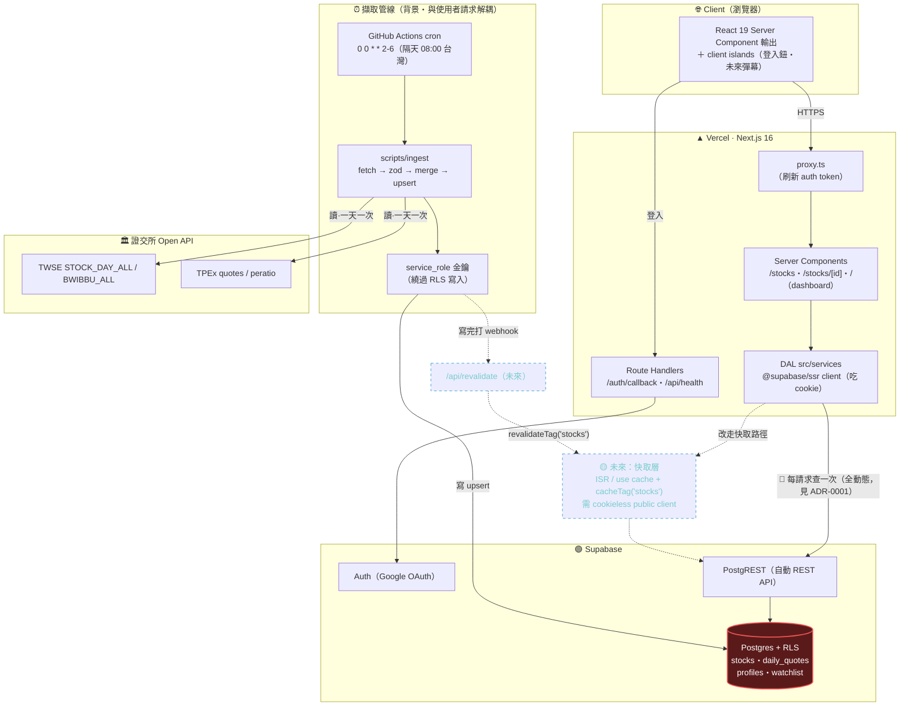

# 系統架構總覽 · 快取點 · 瓶頸 · 擴展策略

> 對應現況（2026-07-24）：Next.js 16 + React 19 + `@supabase/ssr` + Vercel + GitHub Actions。
> 快取決策見 [ADR-0001](ADR-0001-快取策略與revalidate-webhook.md)。

## 完整架構圖



## 圖例

| 標記 | 意義 |
|---|---|
| 🔴 實線「每請求查一次」 | **全動態讀取**：`/stocks`、`/stocks/[id]` 每個請求都 DAL→PostgREST→PG 查一次（ADR-0001 決策） |
| 🟡 虛線節點 | **未來擴展**（尚未實作）：ADR-0001 路徑 A 的快取層 + revalidate webhook |
| 紅底 `PG` | 標示**使用者面最可能的瓶頸**（DB 讀） |
| 「背景・解耦」子圖 | 擷取管線與使用者請求完全分離，一天只跑一次 |

## 快取點盤點

| 位置 | 現況 | 說明 |
|---|---|---|
| `/stocks`、`/stocks/[id]` | **🔴 全動態（ƒ）** | 每請求即時查 DB。永遠最新、零 stale，但每請求一次 DB 讀 |
| `getStockDetail` 的 `cache()` | **單請求記憶化** | 只在同一次 render 內去重（頁面本體＋generateMetadata），**不是**跨請求快取 |
| `/`（dashboard） | 全動態 | 依登入使用者不同，本來就不該快取 |
| `/api/health` | 全動態 | 部署煙霧測試 |
| ISR / `use cache` | **未啟用** | `cacheComponents` 沒開；是未來路徑 A 才會用到 |

---

## 最可能的瓶頸 ＋ 我會先加什麼

### 判斷：使用者面的瓶頸是 **DB 讀**，不是外部 API

很多人第一直覺會說「外部 API 限流」。但在這個架構裡它**不是使用者面的瓶頸**：

- **外部 API 限流**（TPEx 擋非瀏覽器 UA→403、TWSE 公布延遲）只打到**擷取管線**。而擷取一天只跑一次、在 GitHub Actions 背景、與使用者請求**完全解耦**。就算它變慢或被限流，使用者端毫無感覺——因為使用者讀的是 Supabase 裡**已經存好**的資料。所以這是**營運面**風險（某天資料沒更新），已用 `Promise.allSettled`＋重試＋非零結束碼通知緩解，不是效能瓶頸。

- **DB 讀**才是使用者面第一個撐不住的點。因為 ADR-0001 決定全動態，**每一個頁面請求都會 DAL → PostgREST → Postgres 查一次**。而同一檔股票、同一天的資料，對**所有訪客都一模一樣**，卻被重複查 N 次。流量一上來，Supabase 的連線數與 PG 就是最先到頂的地方。

> 一句話：**寫入端已經解耦保護好了；讀取端是完全沒設防的重複查詢。**

### 我會先加：讀取路徑的**快取層**（ISR + tag + revalidate webhook）

**為什麼是這個、而且是第一個**：資料**一天只變一次、且對所有使用者相同** → 快取命中率接近完美。加上 ISR 後，成千上萬個相同查詢會塌縮成「每個 revalidation 週期查一次」。用**最小的工程換最大的 DB 讀降幅**——這就是 ADR-0001 的重啟條件 #1。

**具體第一步**：
1. 拆一個 **cookieless 的公開 Supabase client**（anon key、不掛 cookie adapter），因為現有 `createClient()` 吃 cookie，無法直接進快取。
2. 把 `listStocks` / `getStockDetail` 的公開讀取改用它，並包 `unstable_cache(..., { tags:['stocks'] })`（或開 `cacheComponents` 用 `"use cache"` + `cacheTag('stocks')`）；頁面設一個保底 `revalidate` TTL。
3. 補上 `POST /api/revalidate`，ingest `upsertQuotes` 成功後打它 → `revalidateTag('stocks')` **精準即時失效**，使用者當天就看到新資料。

**刻意排在後面（先不做）**：read replica、連線池調校、PostgREST 前放 CDN。這些要更大流量才划算，而且 ISR 一旦擋掉絕大多數重複讀，這幾項多半就不需要了。

### 加東西的順序

```
1. 讀取路徑 ISR/快取 + revalidate webhook   ← 先加（最小工程、最大降幅）
2. 監控（頁面 P95 延遲、Supabase DB 用量）   ← 確認瓶頸是否位移
3. 仍不夠才上：read replica / 連線池 / edge cache
```

### 面試講法

> 「我會先問**瓶頸在哪一端**。這個系統的寫入端（擷取）已經用背景排程跟使用者請求解耦了，外部 API 限流只影響一天一次的 ingest，使用者無感。真正沒設防的是**讀取端**——因為我刻意讓頁面全動態（ADR-0001），每個請求都查一次 DB，而資料一天只變一次、對所有人又相同。所以我會**先在讀取路徑加 ISR 快取＋用 ingest webhook 做 on-demand revalidation**：把海量重複查詢塌縮成一次，這是投入最小、回報最大的一步。read replica、連線池那些我會留到監控顯示 ISR 之後還不夠再上，不預先過度工程。」
